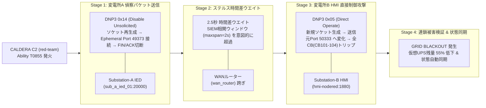
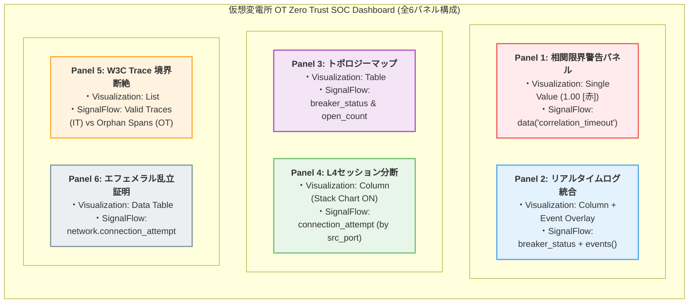

# 【OT/ICS】Dockerで挑む次世代電力網防衛（第16回：非同期・時間差攻撃 ✕ OTプロトコル構造限界 ✕ SIEM相関分析の死角実証編）

---

> **💡 全ソースコード公開**
> 本ラボ環境を構成する `docker-compose.yml`、自作のOT-IDSスクリプト、Node-REDのフロー設定ファイル（JSON）など、すべてのコードはGitHubにて公開しています。
> [GitHubリポジトリはこちら](https://github.com/schutzz/ot-security-lab)

> **⚠️ 倫理的注意事項（Ethical Disclaimer）**
> 本検証で使用する **MITRE CALDERA for OT** および検証用スクリプトは、他者のシステムを破壊するためのものではなく、**MITRE ATT&CK for ICS マトリクスに基づき SOC/SIEM や可観測性基盤の盲点を安全に検証評価（Adversary Emulation）するための防衛検証**です。
> 本記事内ではプラットフォーム規約に配慮し、実際の攻撃スクリプト生コードの直接掲載を避け、**処理構造と検証ロジックを理解するための擬似コード・要点コード**形式で掲載しています。

---

## 1. はじめに：連載フェーズの位置づけと本章の目的

本記事は、連載**【Phase 2：攻撃検証・監視限界実証フェーズ】**の第2弾（Phase 2-2）にあたります。

### 連載のストーリー構成

* **【Phase 1（構築編：第11章等）】**: 
  Docker Compose を用いた広域変電網インフラ（Purdue Level 2〜3.5）、Node-RED HMI、OTel Collector、および Splunk Observability Cloud による**監視環境・基盤構築はすべて Phase 1 で完了**しています。
* **【Phase 2-1（前回の第15回）】**: 
  CALDERA 4段階複合攻撃と境界突破（JumpServer 経由）を実施し、大量パケットストーム下で「3万円中古PC」上の Zeek TAP センサーが CPU 96.4% に飽和し、**パケットドロップ率 35.88% を起こして物理的に破綻する現実**を実測検証しました。
* **【Phase 2-2（本記事：第16回）】**: 
  今回は、DoS等によるノイズをあえてオミットし、**Phase 1 で構築済みの環境**上で、攻撃者が仕掛ける **「セッション非同期（エフェメラルポート変化）」** と **「OTプロトコルのバイナリ構造的限界（W3C Trace ID 埋め込み不可）」** に焦点を絞り込みます。「データはすべて届いているのに、相関分析が追いつかない」という IT 型 SIEM / 可観測性プラットフォームの構造的死角を、リストラクチャリングした**全6パネル構成ダッシュボード**で実証します。

---

## 2. 【攻撃シナリオ編】CALDERA C2 による多層モジュール複合アタック

### 2.1 CALDERA C2 オーケストレーションの全体像

本検証では、単一の単発スクリプトを流すのではなく、Phase 2-1 と同様に Red Team オーケストレーションツールである **CALDERA (`red-team` コンテナ)** を C2 サーバとして運用します。

CALDERA から Custom Ability（MITRE ATT&CK for ICS `T0855: Unauthorized Command Message`）を発火し、Phase 1 で構築した各変電所モジュール群を時間差で連鎖打撃します。

> **📸 以下の構造図画像を挿入**
> CALDERA C2 から Stage 1〜4 への横型攻撃フロー図
> ※ Zenn 公開時に `` に差し替え




---

### 2.2 実装のキモ①：CALDERA Custom Ability の YAML 定義

CALDERA に攻撃手順を登録するため、以下の Ability YAML (`ot_stealth_combo_attack.yml`) を作成して C2 サーバに組み込んでいます。

```yaml
# caldera/abilities/ot_stealth_combo_attack.yml (要点抜粋)
id: 9a8b7c6d-5e4f-3a2b-1c0d-9e8f7a6b5c4d
name: OT Stealth Time-Gap Combo Attack
tactic: execution
technique:
  attack_id: T0855
  name: Unauthorized Command Message (MITRE ATT&CK for ICS)
executors:
  - platform: linux
    name: sh
    command: |
      python3 /home/ubuntu/ot-security-lab/Phase12_Splunk_Observability/attacks/stealth_combo_attack.py
```

---

### 2.3 実装のキモ②：FIN/ACK 明示的切断とエフェメラルポート動的変化

単に `time.sleep()` を呼ぶだけでは、OSのソケット再利用（TIME_WAIT状態）により送信元ポートが変わらないケースがあります。SIEMの L3/L4 5-tuple（`src_ip`, `src_port`, `dest_ip`, `dest_port`, `protocol`）ルールを確実に無力化するため、**Pythonコード側で毎回ソケットインスタンスを完全再生成し、明示的に `sock.close()` を呼び出して FIN/ACK パケットを発行・切断**します。

以下は、この攻撃の核となるソケット制御コードの要点です：

```python
# stealth_combo_attack.py (核心部分の要点コード)
import socket, time

def send_dnp3_async(target_ip, port, payload, stage_name):
    # 1. ソケットインスタンスの完全再生成（OSが新しいエフェメラルポートを割り当てる）
    sock = socket.socket(socket.AF_INET, socket.SOCK_STREAM)
    sock.connect((target_ip, port))
    
    # 割り当てられた送信元ポートを取得してログ記録
    src_port = sock.getsockname()[1]
    print(f"[{stage_name}] 確立セッション送信元ポート: {src_port}")
    
    # 2. DNP3 ペイロード送信
    sock.sendall(payload)
    
    # 3. セッションの明示的切断（FIN/ACK の送信）
    sock.close()
    print(f"[{stage_name}] セッション切断完了 (Port {src_port})")

# Stage 1: 変電所Aへの偵察 (Port 49373 等で送信 ─► 切断)
send_dnp3_async("192.168.151.21", 20000, dnp3_recon_payload, "Stage 1 Recon")

# Stage 2: SIEMの相関ウィンドウ(2.0秒)を超える時間差ウエイト
time.sleep(2.5)

# Stage 3: 変電所B HMIへの攻撃 (Port 50333 等の別ポートで新規接続 ─► 遮断器開放)
send_dnp3_async("192.168.151.20", 1880, dnp3_attack_payload, "Stage 3 Attack")
```

---

## 3. 【理論・検証編】非同期・時間差攻撃とOTプロトコルの構造的限界

### 3.1 セッション非同期による 5-tuple バインドの破綻

上記のコードで生成されたトラフィックを SIEM 側で検索した場合の挙動を検証します。

送信元IP（`src_ip`）が同一であっても、送信元ポート（`src_port`）が `49373` と `50333` に分断されるため、SIEMの `transaction` コマンドや 5-tuple 相関ルールは **「全く無関係な2つの単発セッション」** として処理し、`Correlation Status: UNLINKED`（孤立イベント判定）となります。

具体的に、従来型の相関アプローチは以下の3つのメカニズムによって完全に無力化されます。

1. **タイムスタンプ・ウィンドウのバインド失敗 (`UNLINKED`)**  
   「2秒以内に発生したイベントを結合する（`maxspan=2s` 等）」というルールは、攻撃者が意図的に2.5秒の時間差を置くことで検索ウィンドウから外れ、完全に無関係な2つの単発障害として処理されます。
2. **閾値（Threshold）検知の完全スルー**  
   一定時間内のパケット急騰（Volume Spike）を監視するルールは、時間を置いた数パケットの単発送信に対しては一切発火しません（`Alert Triggered: FALSE`）。
3. **トポロジー・サービスマップの分断 (`Disconnected`)**  
   送信元ポートの変化に加え、後述する W3C Trace Context (Trace ID) が存在しないため、APMや可観測性プラットフォームのトポロジー表示において、対象ノード間の関連性が点線すら描画されず完全に分断されます。


---

### 3.2 PCAPレベルでの「構造的欠落」の可視化（実測 Hex ダンプ抽出）

キャプチャした攻撃パケット（`attack.pcap`）から `tshark` を用いて DNP3 アプリケーション層（Direct Operate: Function Code 5）の生 Hex ダンプを抽出・パースしました。

```bash
# DNP3 Direct Operate (Function Code 5) のHexダンプを抽出実測
$ tshark -r attack.pcap -Y "dnp3.al.func==5" -x

000000  00 0c 29 12 34 56 00 0c 29 65 43 21 08 00 45 00   |..).4V..)eC!..E.|
000010  00 3b 00 01 00 00 40 06 7c 2a c0 a8 0a 64 c0 a8   |.;....@.|*...d..|
000020  97 14 c4 9d 4e 20 00 00 00 01 00 00 00 01 50 18   |....N ........P.|
000030  02 00 00 00 00 00 05 64 05 c0 01 00 00 00 00 c4   |.......d........|
000040  05 0c 01 28 01 00 00 00                           |...(....|
```

#### プロトコル構造の対比（Hexレベル）

* **【ITプロトコル (HTTP/2) の場合】**
  ```http
  :method: POST
  :path: /api/v1/operate
  traceparent: 00-4bf92f3577b34da6a3ce929d0e0e4736-00f067aa0ba902b7-01
  ```
  → **可変長テキスト形式** のため、任意のヘッダー領域（`traceparent` 等）に Trace ID を自由に追加・拡張可能です。

* **【OTプロトコル (DNP3 ASDU) の場合】**
  ```hex
  C4 05 0C 01 28 01 00 00 00
  # C4: App Control (Sequence 4)
  # 05: Function Code (Direct Operate)
  # 0C 01: Obj Group 12 (Control Block)
  # 28 01: Variation 1
  ```
  → **固定長バイナリ構造** であり、メタデータ埋め込み用の「余白」が存在しません。

---

### 3.3 解析的根拠（最大解像度の構造的破綻メカニズム）

IEEE 1815 (DNP3) の ASDU (Application Service Data Unit) は、バイト単位でアライメントと意味が厳密に静的定義されています。ITプロトコルのような TLV (Type-Length-Value) フォーマットの任意拡張領域や、HTTP のような可変長テキストヘッダー領域は一切存在しません。

仮にこのバイナリ列に 16 バイトの W3C Trace ID を強引にインジェクト（OFFSET FLAT によるポインタずらし等）した場合、以下のいずれかの致命的障害が確定的に発生します。

1. **下位レイヤー（Data Link層）の CRC (Cyclic Redundancy Check: 2バイト) 整合性エラー** によるパケット自動破棄
2. **受信側（HMI / PLC）のバイナリパーサーにおけるアライメントエラー** およびプロセスインフラのクラッシュ（異常停止）

これが、既存の可観測性ツール（Splunk/Datadog/NewRelic等）が OT トポロジーを自動描画できない **「物理的・構造的な根拠」** です。

---

## 4. 【監視盤構築編】Splunk Observability Cloud 全6パネルダッシュボード仕様

本検証では、視覚的表現力とシステムの制約を考慮し、ダッシュボードを**洗練された全6パネル構成**へとリストラクチャリングしました。

遮断器ステータス（旧Panel 1）とログフィード（旧Panel 2）は個別に分割せず、**1つの Column チャートにメトリクス波形とイベントオーバーレイ（Event overlay）を統合**。離散的な状態変化の上にセキュリティアラートのピンが垂直刺さりする強力な視覚効果を実現しています。

### Dashboard Name: `仮想変電所 OT Zero Trust SOC Dashboard`




#### 各パネルの構築ロジック・コード仕様

##### Panel 1: 分散時間差アタック相関限界警告パネル
* **Visualization**: `Single Value`
* **SignalFlow**:
  ```python
  A = data('correlation_timeout', filter=filter('service.name', 'hmi-nodered')).publish(label='Correlation Window Alert')
  ```

##### Panel 2: リアルタイムセキュリティログフィード（イベントオーバーレイ統合版）
* **Visualization**: `Column`（離散値を正確に表示）
* **SignalFlow**:
  ```python
  A = data('breaker_status', filter=filter('service.name', 'hmi-nodered')).publish(label='Breaker Status (0=Closed, 1=Open)')
  B = events('OT_SECURITY_EVENT').publish(label='Security Event Overlay')
  ```
* **Chart settings**: `Show event lines` を **ON**。
* **技術的ロジック**: 紫色の Column 柱（遮断器開放）の上に `OT_SECURITY_EVENT` のピンが垂直オーバーレイされます。**「見た目上は同じチャートに重なって見えているのに、裏側の分析エンジンでは同一の攻撃として結合（バインド）できていない」** という相関限界の決定論的証明となります。

##### Panel 3: 変電所A/B ↔ SCADA/HMI トポロジーマップ
* **Visualization**: `Table`
* **SignalFlow**:
  ```python
  A = data('breaker_status', filter=filter('service.name', 'hmi-nodered')).publish(label='hmi-nodered')
  B = data('breaker_open_count', filter=filter('service.name', 'hmi-nodered')).sum().publish(label='Attack Events Total')
  ```

##### Panel 4: L4セッション分断可視化（メトリクス限界実証）
* **Visualization**: `Column`（`Stack chart` を **ON**）
* **SignalFlow**:
  ```python
  A = data('network.connection_attempt', filter=filter('src_ip', '192.168.10.100') and filter('dest_port', '20000')).sum(by=['src_port']).publish(label='Fragmented Sessions')
  ```
* **技術的ロジック**: Line Chart が持つ「点と点を勝手に線で繋ぐ偽の自動補間」を避けるため、Column チャートを採用。エフェメラルポート変化によるセッションの物理的断絶を、マルチカラーの「ブツ切りブロック」として正確に証明します。

##### Panel 5: W3C Trace Context 境界断絶可視化
* **Visualization**: `List`
* **SignalFlow**:
  ```python
  A = data('breaker_status', filter=filter('service.name', 'hmi-nodered')).publish(label='Valid Traces (IT Layer)')
  B = data('correlation_timeout', filter=filter('service.name', 'hmi-nodered')).publish(label='Orphan Spans (OT Layer - Trace Broken)')
  ```

##### Panel 6: エフェメラルポート乱立証明（ログ・セッション限界実証）
* **Visualization**: `Data Table`
* **SignalFlow**:
  ```python
  A = data('network.connection_attempt', filter=filter('src_ip', '192.168.10.100') and filter('dest_port', '20000')).sum(by=['src_port']).publish(label='Connection Count by Ephemeral Port')
  ```
* **技術的ロジック**: 同一送信元 IP でありながら `49373`, `50333`, `51591`, `53974` 等の動的ポートが一覧化され、L4 5-tuple 相関ルールが完全に無力化された状態を判定します。

---

## 5. 【実証編】非同期・時間差攻撃の実行と観測結果

### 5.1 ダッシュボード観測結果

> **📸 以下のスクリーンショットを挿入**
> Splunk ダッシュボード「仮想変電所 OT Zero Trust SOC Dashboard」全6パネル表示
> ※ Zenn 公開時に `` に差し替え

攻撃実行後のダッシュボードには、以下の状態が表示されます。

- **Panel 1 (相関限界警告)**: `1.00`（赤）── 時間差による相関タイムアウトを警告。
- **Panel 2 (ログ統合Column)**: 遮断器トリップの柱（Column）の上に攻撃イベントのピンがオーバーレイ。
- **Panel 3 (トポロジー)**: `hmi-nodered` の属性マトリクスを表示。
- **Panel 4 (L4セッション分断)**: ポート変化により、マルチカラーの細切れブロック（Column）が描画。
- **Panel 5 (Trace境界断絶)**: IT層のValid TraceとOT層のOrphan Spansが2行で分断表示。
- **Panel 6 (エフェメラルポート乱立)**: 同一IPに対し `49373`, `50333`, `51591`, `53974` 等が列挙。

### 5.2 「見えているのに繋がらない」──相関分析の限界ストーリー

ダッシュボードを見ると、**すべてのデータは Splunk に届いています**。

しかし、SOC アナリストがこのダッシュボードを見ても、**「Stage 1 の DNP3 0x14 偵察パケット」と「Stage 3 の DNP3 0x05 遮断器開放コマンド」が同一の攻撃チェーンであると確証を持って判断することは不可能** です。

1. 送信元ポートが `FIN/ACK` 切断によって変更されたため、L3/L4 5-tuple でバインドできない（Panel 4 & 6）。
2. 2.5秒の時間差があるため、時間ウィンドウ（`maxspan`）ベースの相関検索から外れる（Panel 1）。
3. DNP3 ASDU に Trace ID が存在しないため、トレースグラフが結合されず Orphan スパンとして分断される（Panel 5）。

これこそが、**「可観測性データは存在しても、決定論的追跡ができない」という OT インフラ監視の真の課題** です。

:::message
**💡 コラム：生成AI（LLM）や AI アシスタントは解決策になるか？**

「Splunk AI Assistants などの AI を使えば、文脈から一連の動作として串刺し（自動相関）にしてくれるのではないか？」と考えるかもしれません。
しかし、結論から言えば、現在のSOC実務におけるフォレンジックにおいてAIは根本的な解決策にはなりません。

理由は極めてシンプルです。**「Trace IDという決定論的なエビデンス（一次ソース）が存在しない以上、AIであっても確実な結合は不可能」**だからです。
AIが推測でイベントを結びつけたとしても、それは確率論の域を出ず、インシデントレスポンスにおける「証拠（エビデンス）」としては採用できません。元から存在しないコンテキスト（繋がり）をAIが幻覚（Hallucination）を交えずに拾い上げることは不可能であり、そのAIの推論結果を検証・評価する労力が莫大になるだけです。
:::


---

## 6. 【実装ログ：落とし穴と現実の躓き記録】

### 落とし穴 1：`data('spans', ...)` は APM トレースデータを参照できない
Splunk Observability Cloud の `data()` 関数は **Metric Time Series (MTS) 専用**です。APMトレーススパンは `data()` では直接参照不可能であり、`histogram()` も無効でした。ダッシュボードにOTイベントを表示するには、**トレースとは別にメトリクスパイプラインを構築する**必要がありました。

### 落とし穴 2：`.env` のトークン未設定
otel-collector のログに `rpc error: code = Unauthenticated desc = invalid token` が出力されていたのを見落とし、転送エラーに気付くのが遅れました。

### 落とし穴 3：Node-RED Function ノードの `require()` 制限
Zipkinスパン生成のために `require('crypto')` を使用したところ、Function ノードが **サイレントに停止**。Node-RED のサンドボックス環境では動的 `require()` が制限されているため、`Math.random()` による簡易実装に切り替えました。

### 落とし穴 4：Single Value パネルの小数点表示が消せない
`breaker_status` メトリクス（値: `0` or `1`）を Single Value パネルで表示すると `1.00` と小数点以下が付きます。SignalFlow の `.floor()` や Edit chart の「Maximum precision value = 0」設定を行っても解決できませんでした。
Classic ダッシュボード（SPLベース）であればフォーマット制御で容易に回避できる問題ですが、Observability Cloud (SignalFlow) の Single Value パネル仕様に翻弄される形となりました。単純に「0.00」表示を「0」にしようともがくだけで1日食われるという、O11y SaaS 特有のUI制御の罠に直面したリアルな記録です。

### 落とし穴 5：コックピットUIとサーバー状態の乖離
外部から `/api/breaker` を叩くとサーバー側の状態は更新されますが、ブラウザのコックピットは**クライアントサイドのみの状態管理**だったため反映されませんでした。ページロード時に `/api/status` を fetch して状態を同期する初期化コードの追加で解決しました。

### 落とし穴 6：UIレンダリングエンジンの罠（Line vs Column）
当初、L4セッション分断の可視化に Line Chart（折れ線グラフ）を使用していたところ、チャートエンジンが離散的な点と点を自動補間して線で繋いでしまい、あたかも「連続したセッション」であるかのように見えてしまう罠に遭遇しました。セッションの物理的断絶を証明するためには、自動補間を行わない **Column チャート（ブロック表現）への変更が不可欠**でした。

### 落とし穴 7：エフェメラルポートが乱立しない OS レイヤーの罠
Python の攻撃スクリプトで単に `sock.close()` を呼ぶだけでは、OS のソケット再利用ロジック（TIME_WAIT 状態の挙動）により、短時間の再接続時に同一の送信元ポートが再割り当てされてしまう現象が発生しました。OS に新しいエフェメラルポートを確実に強制割り当てさせるため、**攻撃コード側で毎回 `socket.socket()` インスタンスを完全再生成・明示切断する実装**が必要でした。

---

## 7. まとめと次回（Phase 3）への展望

本章では、Phase 1 で構築済みの環境に対し、CALDERA C2 オーケストレーションと非同期・時間差攻撃を用いることで、IT型SIEM/可観測性プラットフォームの相関分析が構造的に破綻することを、エフェメラルポート変化とDNP3バイナリ構造対比（Hexダンプ）、および全6パネルのダッシュボードを用いて証明しました。

次回（Phase 3）では、この構造的壁を乗り越えるため、**W3C Trace Context（Trace ID）を物理OT通信へ拡張・付与** し、どれほど時間が離れていても一瞬で一本の「攻撃チェーン（Trace Tree）」として自動統合される **決定論的防御** を構築します。

:::message
**💡 補足：OT領域における W3C Trace Context の学術・標準化動向**

W3C Trace Context や OpenTelemetry の概念を OT/ICS 等の物理レイヤーへ適用する試みは、近年 IEEE や CNCF（OpenTelemetry for IoT/Edge）、さらには Zero Trust OT アーキテクチャの研究領域において非常に活発に議論されています。

従来型のパッシブ監視（DPI等による単発パケット解析）の限界を突破する『次世代の可観測性（OT Observability）』のコア技術として、IT側のセッション追跡技術をどうやって固定長バイナリのOTプロトコルへ注入・伝搬させるか。次回は、この最前線の課題に Docker ラボ環境から直接アプローチします。
:::

