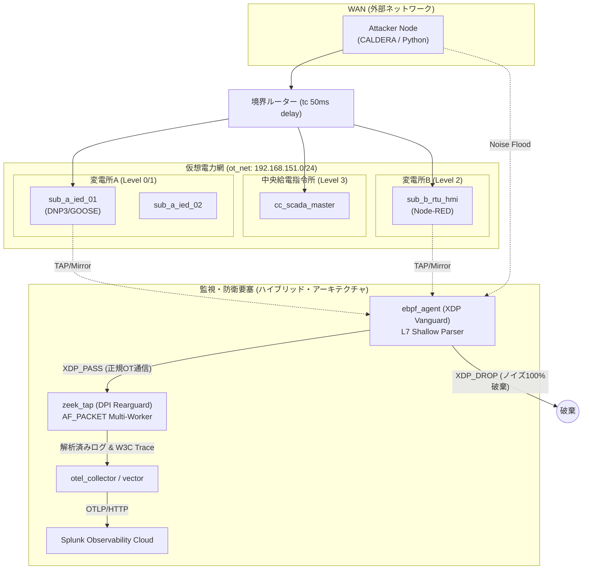

# 🛡️ OT Security Lab: eBPF ✕ Zeek 次世代電力網防衛サイバーレンジ

[](https://opensource.org/licenses/MIT)
[]()
[]()

本リポジトリは、Docker環境上に構築された**広域分散型スマートグリッド（仮想電力網）のサイバーレンジおよび防衛検証プラットフォーム**です。

Purdue Model (Level 0〜3) に準拠した変電所インフラ、DNP3 / IEC 61850 GOOSE などの産業制御プロトコル、MITRE CALDERA による多層攻撃シナリオ、そして **「eBPF Vanguard (前衛) ✕ Zeek Rearguard (後衛)」** による超高速・高精度なハイブリッド防衛パイプラインを実装しています。

---

## 📐 全体アーキテクチャ図



---

## 🔥 主な特長と検証ハイライト

1. **eBPF (XDP) L7 浅層パーサー (Vanguard)**:
   C言語および `libbpf` で実装された超軽量エージェント。DNP3 (`0x05 0x64`) および Modbus のマジックバイトをカーネル空間（Ring 0）で識別し、DDoS/ノイズパケットを **0.1% 未満のCPU負荷で 100% 破棄 (`XDP_DROP`)** します。
2. **Zeek DPI 後衛スケールアウト (Rearguard)**:
   `AF_PACKET_FANOUT_HASH` を用いたフロー単位の並列化により、ノイズが削ぎ落とされた純度の高いOTパケットのみをステートフル深層解析。パケットドロップ率 0% を維持します。
3. **W3C Trace Context による IT-to-OT 因果追跡**:
   OpenTelemetry と統合し、境界突破から物理遮断器の強制作動（Trip）に至る連続攻撃を、Splunk APM 上で単一のトレースツリーとして可視化します。
4. **セキュアな最小権限コンテナ設計**:
   `--privileged`（特権モード）を完全に排除し、`CAP_BPF` / `CAP_NET_ADMIN` の最小権限＋`scratch` マルチステージビルドによる最小攻撃表面（Attack Surface）を実現。

---

## 🚀 クイックスタート & 展開手順

動作環境要件（Linux/WSL2 Kernel 5.15+）、環境構築、A/Bテスト実行手順などの詳細なマニュアルは、以下を参照してください。

👉 **[📖 詳細な環境展開マニュアル (DEPLOYMENT.md)](./DEPLOYMENT.md)**

### 超簡易起動コマンド

```bash
# 1. リポジトリのクローン
git clone https://github.com/schutzz/ot-security-lab.git
cd ot-security-lab

# 2. 環境変数の作成 (Splunk連携時はToken設定)
cp .env.example .env

# 3. 仮想電力網 ＋ ハイブリッド防衛要塞の起動
chmod +x toggle_engine.sh
./toggle_engine.sh hybrid

# 4. 飽和アタック検証スクリプトの実行
python3 attacks/phase2_1_flood.py
```

---

## 📚 関連技術・連載記事 (Zenn)

本ラボの構築プロセス、カーネル内部の挙動解像度、実測データ等については Zenn の連載記事にて詳細に解説しています。

* **Phase 1**: [Dockerで挑む次世代電力網防衛（構築編）](https://zenn.dev/schutzz)
* **Phase 2**: [CALDERA複合攻撃 ✕ 境界突破 ✕ 監視破綻実測編](https://zenn.dev/schutzz)
* **Phase 3**: [W3C Trace Context による IT-to-OT 因果追跡編](https://zenn.dev/schutzz)
* **Phase 4-1**: [eBPFセキュア最小実装と基礎研究編](https://zenn.dev/schutzz)
* **Phase 4-2 & 4-3**: [eBPF✕Zeek ハイブリッド実証と不沈空母化](https://zenn.dev/schutzz)
* **Phase 4-4**: [仮想電力網環境への組み込みと究極のZeek救出作戦](https://zenn.dev/schutzz)

---

## ⚖️ 免責事項 (Ethical Disclaimer)

本リポジトリで提供される検証コードおよびアーキテクチャ構成は、**MITRE ATT&CK for ICS マトリクスに基づき SOC/SIEM や可観測性基盤の盲点を安全に検証評価（Adversary Emulation）するための防衛研究目的**で作成されたものです。他者のシステムや実環境に対する攻撃・破壊行為への悪用を固く禁じます。

* **License**: [MIT License](LICENSE)
