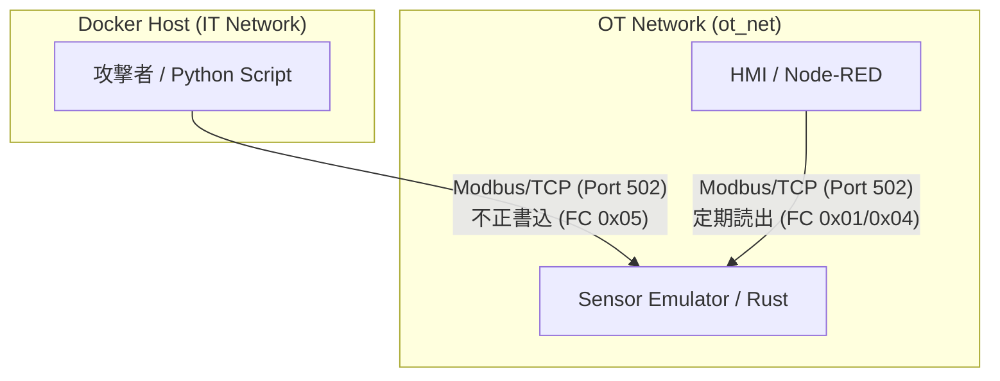

# OT Security Lab (Docker based)

Docker環境で構築された、学習用のOT/ICSセキュリティラボです。
物理機器（センサー）のシミュレータと、Node-REDによるHMI（監視盤）をコンテナで立ち上げ、実際のパケットキャプチャやメモリ汚染攻撃（スタックスネット等で用いられた手法）を体験することができます。

## アーキテクチャ図



## 構築・起動手順

1. リポジトリをクローンし、ディレクトリに移動します。
2. 以下のコマンドで全コンテナをバックグラウンド起動します。
   ```bash
   docker-compose up -d
   ```
3. 数秒待つと、以下の環境が整います。
   - **HMI (Node-RED)**: [http://localhost:1880/ui](http://localhost:1880/ui) （監視ダッシュボード）
   - **Sensor Emulator**: 内部IP `192.168.100.11` でModbus/TCP (Port 502) が稼働

## 遊び方（攻撃の再現）

攻撃者として、OT網内に配置されたセンサーの「侵入検知状態（Coil 0）」を強制的に上書きし、監視員の目をごまかす攻撃を体験します。

### 1. 攻撃とキャプチャ（サイドカー方式）
センサーに対する攻撃パケットを確実に捉えるため、サイドカー（相乗り）コンテナでキャプチャを仕掛けます。

**ターミナル1（キャプチャ開始）:**
```bash
docker run --name sniffer -it \
  --net container:sensor-emulator \
  alpine sh -c "apk add --no-cache tcpdump && tcpdump -i any tcp port 502 -w /tmp/attack_traffic_true.pcap"
```

**ターミナル2（攻撃実行）:**
```bash
docker run --rm -it --network ot-lab_ot_net --ip 192.168.100.50 -v $(pwd)/test_modbus.py:/exploit.py python:3-slim python3 /exploit.py
```
> ※ Node-REDのダッシュボード（`localhost:1880/ui`）を開いた状態で行うと、警告が強制的に消去される瞬間を目撃できます。

**ターミナル1（回収）:**
攻撃完了後、`Ctrl+C` でパケットキャプチャを停止し、ファイルを回収します。
```bash
docker cp sniffer:/tmp/attack_traffic_true.pcap ./
docker rm sniffer
```

### 2. 自作IDSパーサーによる検知
攻撃の痕跡を、Python製の自作パーサー（Scapy使用）でバイナリレベルから暴き出します。

*(※実行には `scapy` ライブラリが必要です。未インストールの場合は `pip install scapy` または `sudo apt install python3-scapy` で導入してください)*

```bash
python3 ids_parser.py attack_traffic_true.pcap
```

赤い警告画面（CRITICAL SECURITY ALERT）が表示されれば成功です！
