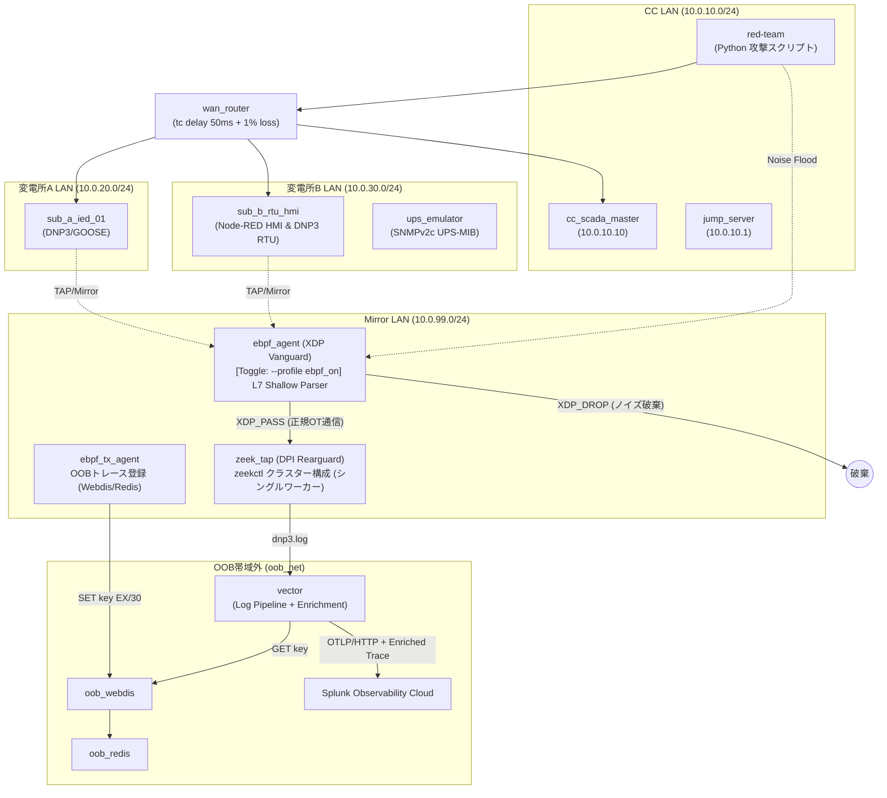

# OT Security Lab: 次世代電力網防衛サイバーレンジ (Phase 1 〜 4 集大成)

[](https://opensource.org/licenses/MIT)
[]()
[]()

本リポジトリは、Docker環境上に構築された**広域分散型スマートグリッド（仮想電力網）のサイバーレンジおよび防衛検証プラットフォーム**です。

Purdue Model (Level 0〜3) に準拠した変電所インフラ、DNP3 / IEC 61850 GOOSE などの産業制御プロトコル、MITRE CALDERA による多層攻撃シナリオ、そして **「W3C Trace Context による IT-to-OT 因果追跡」** および **「eBPF Vanguard ✕ Zeek Rearguard ハイブリッド防衛」** の両機能を備え、それぞれの効果を動的に ON/OFF 切り替えて定量検証できる実験基盤を提供します。

---

## 🎛️ 本ラボの核となる 2 大検証トグル機能 (ON / OFF)

本環境では、防衛メカニズムの効果を客観的に測定するため、以下の 2 つの制御トグルを備えています。

### 1. W3C Trace Context (IT-to-OT 因果追跡) トグル
* **OFF モード (従来型SIEM/IDS方式)**:
  各ログが独立したIP/ポート情報のみで記録されます。攻撃者がエフェメラルポートを変更したりランダムな遅延を入れた場合、SIEM側では個々のログの相関が途切れ、IT境界侵入と変電所物理遮断の因果関係を見失う現象を再現します。
* **ON モード (分散トレース相関分析方式)**:
  OpenTelemetry 経由で `traceparent` (W3C Trace Context) ヘッダーを制御パケット・ログに注入。HMI上のボタン操作から現場RTUの遮断器作動（Trip）に至る一連のキルチェーンを、Splunk APM 上で単一のトレースツリーとして一気通貫表示します。

### 2. eBPF Vanguard (カーネル空間パケットドロップ) トグル (`toggle_engine.sh`)
* **OFF モード (Legacy / Zeek単体構成)**:
  すべてのトラフィック（大量のDDoSノイズ含む）をユーザー空間の Zeek へ引き上げます。数十万PPSのパケットストーム下で Zeek の CPU 使用率が 96% 超に達し、35% 以上のパケットドロップが発生して監視網が崩壊する限界を再現します。
* **ON モード (Hybrid / eBPF + Zeek 構成)**:
  カーネル空間（Ring 0）の NIC ドライバ直下に C言語で実装した **eBPF (XDP) L7 浅層パーサー** を挿入。DNP3/Modbus 以外のノイズパケットをゼロコピーで 100% 破棄 (`XDP_DROP`) し、後衛の Zeek の CPU 使用率を 0.1% に抑え込みパケットドロップ 0% を達成します。

---

## 📐 全体アーキテクチャ図



---

## 🏗️ フェーズ別構成と全機能一覧 (Phase 1 〜 Phase 4)

### Phase 1: 仮想スマートグリッド基盤の構築 (Purdue Level 0〜3)
* **ネットワーク分離と遅延注入**: Linux `tc` (Traffic Control) を使用し、WAN/LAN 境界ルーター経由で 50ms の現実的な通信遅延を模擬。
* **産業制御プロトコル実装**:
  * **DNP3**: 変電所 RTU 制御（FC `0x05` Direct Operate 遮断器開閉、FC `0x14` Disable Unsolicited）
  * **IEC 61850 GOOSE**: 変電所間高速保護継電器アライアンス（L2 パケット）
  * **SNMPv2c**: 変電所非常用 UPS 補機電源制御 (RFC 1628 UPS-MIB `.1.3.6.1.2.1.33.1.1.4`)
* **Node-RED HMI**: 現場の遮断器状態（OPEN/CLOSE）および電圧・電流メタデータをリアルタイム描画。

### Phase 2: MITRE CALDERA による多層攻撃 ✕ 監視破綻の実測
* **CALDERA C2 オーケストレーション**:
  * **Stage 1 (境界突破)**: 窃取トークンによる JumpServer 境界認証の無傷すり抜け
  * **Stage 2 (消音化)**: DNP3 FC `0x14` 送出による RTU 自発発報の強制停止
  * **Stage 3 (連鎖物理破壊)**: DNP3 FC `0x05` (遮断器強制作動) ✕ SNMP (UPS強制作動停止) の二重打撃
  * **Stage 4 (飽和ノイズ攻撃)**: 約60万パケットの超高密度 UDP フラッド連射
* **監視破綻の定量立証**: ユーザー空間 DPI (Zeek) の CPU 使用率が 96.4% に高騰し、35.88% のパケットドロップが発生して攻撃検知が物理破綻することを証明。

### Phase 3: W3C Trace Context による IT-to-OT 因果追跡
* **分散トレース連携**: OpenTelemetry Collector ＋ Vector ＋ Splunk Observability Cloud 構成。
* **相関ID注入**: DNP3 アプリケーションヘッダーおよび内部イベントログへ W3C Trace Context (`traceparent`) を統合。
* **因果関係の可視化**: 単純なIP/ポート相関検索の限界を克服し、境界侵入から変電所ブラックアウトに至るキルチェーンを単一の APM トレースツリーとして可視化。

### Phase 4: eBPF Vanguard ✕ Zeek Rearguard ハイブリッド防衛
* **eBPF (XDP) L7 浅層パーサー (Vanguard)**:
  * C言語および `libbpf` 製の極軽量カーネルエージェント。
  * 可変長ヘッダの動的オフセット計算 (`OFFSET FLAT`) および Verifier 境界チェックを実装。
  * DNP3 (`0x05 0x64`) および Modbus のプロトコル構造をカーネル空間（Ring 0）で判定。
* **BPF Pinning ("不沈空母" 化)**:
  * `/sys/fs/bpf/xdp_pass_prog` への BPF リンクのピン留めにより、エージェントコンテナが `docker kill` されてもカーネル内でパケットドロップ動作が自律継続。
* **Zeek zeekctl クラスター構成 (Rearguard)**:
  * Manager/Logger/Proxy/Worker の 4 プロセス構成で稼働。Docker 環境では **シングルワーカー** (`interface=eth0`)。将来の物理 NIC 環境では `PACKET_FANOUT_HASH` による 5-tuple フロー単位のマルチワーカー並列化に対応可能。
* **OOB トレースコンテキスト エンリッチメント**:
  * eBPF tx_agent が Webdis/Redis に `src-dst-fc` キー（TTL=30秒）で W3C Trace Context を事前登録。Zeek ログが Vector に届いた際、同一キーで GET して DNP3 ログにトレースIDを結合する。
  * **DNP3 ログバッファリング無効化** (`Log::set_buf(DNP3::LOG, F)`) でバースト時の遅延を抑制。
* **セキュアな最小権限コンテナ**:
  * `--privileged`（特権モード）を排除し、`CAP_BPF` / `CAP_NET_ADMIN` 最小権限 ✕ `scratch` マルチステージビルドを採用。

---

## 🚀 クイックスタート & 展開手順

動作環境要件（Linux/WSL2 Kernel 5.15+）、環境構築、A/Bテスト実行手順などの詳細なマニュアルは、以下を参照してください。

* **[詳細な環境展開マニュアル (DEPLOYMENT.md)](./DEPLOYMENT.md)**

### トグル切り替え実行コマンド

```bash
# 1. リポジトリのクローン
git clone https://github.com/schutzz/ot-security-lab.git
cd ot-security-lab/02_Power_Grid_Defense

# 2. 環境変数の作成
cp .env.example .env

# --- [起動パターン] ---

# パターン A: 標準モード (Zeek + Vector のみ / eBPF OFF)
docker compose up -d

# パターン B: ハイブリッドモード (eBPF ON + Zeek)
docker compose --profile ebpf_on up -d

# 起動後、Zeek クラスターを有効化
docker exec zeek_tap zeekctl deploy

# --- [攻撃シナリオの再演] ---

# マイクロバースト攻撃（100パケット DNP3 Direct Operate）
docker exec red-team python3 /attacks/microburst_attack_v3.py

# キルチェーン全段階攻撃
docker exec red-team python3 /attacks/attack_stage2_3_strike.py

# --- [検証ログ確認] ---

# enrichment_status の hit/miss 確認
docker logs vector 2>&1 | grep enrichment_status | tail -10

# Redis キーと TTL の確認（攻撃実行中）
docker exec oob_redis redis-cli MONITOR
```

---

## 📚 関連技術・連載記事 (Zenn)

本ラボの構築プロセス、カーネル内部の挙動解像度、実測データ等については Zenn の連載記事にて詳細に解説しています。

* **Phase 1**: [Dockerで挑む次世代電力網防衛（構築編）](https://zenn.dev/schutzz)
* **Phase 2**: [CALDERA複合攻撃 ✕ 境界突破 ✕ 監視破綻実測編](https://zenn.dev/schutzz)
* **Phase 3**: [W3C Trace Context による IT-to-OT 因果追跡編](https://zenn.dev/schutzz)
* **Phase 4-1**: [eBPFセキュア最小実装と基礎研究編](https://zenn.dev/schutzz)
* **Phase 4-ex**: [TCミラーリング再構築](https://zenn.dev/schutzz)
* **Phase 4-2 & 4-3**: [eBPF✕Zeek ハイブリッド実証と不沈空母化](https://zenn.dev/schutzz)
* **Phase 4-4**: [仮想電力網環境への組み込みと究極のZeek救出作戦](https://zenn.dev/schutzz)

---

## 免責事項 (Ethical Disclaimer)

本リポジトリで提供される検証コードおよびアーキテクチャ構成は、MITRE ATT&CK for ICS マトリクスに基づき SOC/SIEM や可観測性基盤の盲点を安全に検証評価（Adversary Emulation）するための防衛研究目的で作成されたものです。許可されていない第三者のシステムや実環境に対する攻撃・破壊行為への悪用を固く禁じます。

* **License**: [MIT License](LICENSE)
